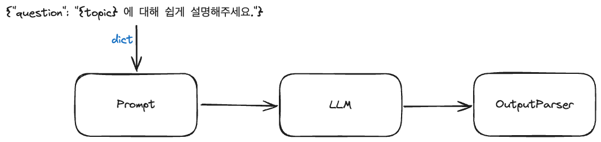

<style>
    .custom {
        background-color: #008d8d;
        color: white;
        padding: 0.25em 0.5em 0.25em 0.5em;
        white-space: pre-wrap;       /* css-3 */
        white-space: -moz-pre-wrap;  /* Mozilla, since 1999 */
        white-space: -pre-wrap;      /* Opera 4-6 */
        white-space: -o-pre-wrap;    /* Opera 7 */
        word-wrap: break-word;    
    }
    
    pre {
        background-color: #027c7c;
        padding-left: 0.5em;
    }
</style>
    

## 기본 예시: 프롬프트 + 모델 + 출력 파서

가장 기본적이고 일반적인 사용 사례는 prompt 템플릿과 모델을 함께 연결하는 것입니다. 이것이 어떻게 작동하는지 보기 위해, 각 나라별 수도를 물어보는 Chain을 생성해 보겠습니다.


```python
# API KEY를 환경변수로 관리하기 위한 설정 파일
from dotenv import load_dotenv

# API KEY 정보로드
load_dotenv()
```

```python
# LangSmith 추적을 설정합니다. https://smith.langchain.com
# !pip install -qU langchain-teddynote
from langchain_teddynote import logging

# 프로젝트 이름을 입력합니다.
logging.langsmith("CH01-Basic")
```
## 프롬프트 템플릿의 활용

`PromptTemplate`

- 사용자의 입력 변수를 사용하여 완전한 프롬프트 문자열을 만드는 데 사용되는 템플릿입니다
- 사용법
  - `template`: 템플릿 문자열입니다. 이 문자열 내에서 중괄호 `{}`는 변수를 나타냅니다.
  - `input_variables`: 중괄호 안에 들어갈 변수의 이름을 리스트로 정의합니다.

`input_variables`

- input_variables는 PromptTemplate에서 사용되는 변수의 이름을 정의하는 리스트입니다.

```python
from langchain_teddynote.messages import stream_response  # 스트리밍 출력
from langchain_core.prompts import PromptTemplate
```
`from_template()` 메소드를 사용하여 PromptTemplate 객체 생성


```python
# template 정의
template = "{country}의 수도는 어디인가요?"

# from_template 메소드를 이용하여 PromptTemplate 객체 생성
prompt_template = PromptTemplate.from_template(template)
prompt_template
```

```python
# prompt 생성
prompt = prompt_template.format(country="대한민국")
prompt
```

```python
# prompt 생성
prompt = prompt_template.format(country="미국")
prompt
```

```python
from langchain_openai import ChatOpenAI

model = ChatOpenAI(
    model="gpt-3.5-turbo",
    max_tokens=2048,
    temperature=0.1,
)
```
## Chain 생성

### LCEL(LangChain Expression Language)



여기서 우리는 LCEL을 사용하여 다양한 구성 요소를 단일 체인으로 결합합니다

```
chain = prompt | model | output_parser
```

`|` 기호는 [unix 파이프 연산자](<https://en.wikipedia.org/wiki/Pipeline_(Unix)>)와 유사하며, 서로 다른 구성 요소를 연결하고 한 구성 요소의 출력을 다음 구성 요소의 입력으로 전달합니다.

이 체인에서 사용자 입력은 프롬프트 템플릿으로 전달되고, 그런 다음 프롬프트 템플릿 출력은 모델로 전달됩니다. 각 구성 요소를 개별적으로 살펴보면 무슨 일이 일어나고 있는지 이해할 수 있습니다.


```python
# prompt 를 PromptTemplate 객체로 생성합니다.
prompt = PromptTemplate.from_template("{topic} 에 대해 쉽게 설명해주세요.")

model = ChatOpenAI()

chain = prompt | model
```
### invoke() 호출

- python 딕셔너리 형태로 입력값을 전달합니다.(키: 값)
- invoke() 함수 호출 시, 입력값을 전달합니다.

```python
# input 딕셔너리에 주제를 '인공지능 모델의 학습 원리'으로 설정합니다.
input = {"topic": "인공지능 모델의 학습 원리"}
```

```python
# prompt 객체와 model 객체를 파이프(|) 연산자로 연결하고 invoke 메서드를 사용하여 input을 전달합니다.
# 이를 통해 AI 모델이 생성한 메시지를 반환합니다.
chain.invoke(input)
```
아래는 스트리밍을 출력하는 예시 입니다.

```python
# 스트리밍 출력을 위한 요청
answer = chain.stream(input)
# 스트리밍 출력
stream_response(answer)
```
### 출력파서(Output Parser)


```python
from langchain_core.output_parsers import StrOutputParser

output_parser = StrOutputParser()
```
Chain 에 출력파서를 추가합니다.

```python
# 프롬프트, 모델, 출력 파서를 연결하여 처리 체인을 구성합니다.
chain = prompt | model | output_parser
```

```python
# chain 객체의 invoke 메서드를 사용하여 input을 전달합니다.
input = {"topic": "인공지능 모델의 학습 원리"}
chain.invoke(input)
```

```python
# 스트리밍 출력을 위한 요청
answer = chain.stream(input)
# 스트리밍 출력
stream_response(answer)
```
### 템플릿을 변경하여 적용

- 아래의 프롬프트 내용을 얼마든지 **변경** 하여 테스트 해볼 수 있습니다.
- `model_name` 역시 변경하여 테스트가 가능합니다.

```python
template = """
당신은 영어를 가르치는 10년차 영어 선생님입니다. 주어진 상황에 맞는 영어 회화를 작성해 주세요.
양식은 [FORMAT]을 참고하여 작성해 주세요.

#상황:
{question}

#FORMAT:
- 영어 회화:
- 한글 해석:
"""

# 프롬프트 템플릿을 이용하여 프롬프트를 생성합니다.
prompt = PromptTemplate.from_template(template)

# ChatOpenAI 챗모델을 초기화합니다.
model = ChatOpenAI(model_name="gpt-4-turbo")

# 문자열 출력 파서를 초기화합니다.
output_parser = StrOutputParser()
```

```python
# 체인을 구성합니다.
chain = prompt | model | output_parser
```

```python
# 완성된 Chain을 실행하여 답변을 얻습니다.
print(chain.invoke({"question": "저는 식당에 가서 음식을 주문하고 싶어요"}))
```

```python
# 완성된 Chain을 실행하여 답변을 얻습니다.
# 스트리밍 출력을 위한 요청
answer = chain.stream({"question": "저는 식당에 가서 음식을 주문하고 싶어요"})
# 스트리밍 출력
stream_response(answer)
```

```python
# 이번에는 question 을 '미국에서 피자 주문'으로 설정하여 실행합니다.
# 스트리밍 출력을 위한 요청
answer = chain.stream({"question": "미국에서 피자 주문"})
# 스트리밍 출력
stream_response(answer)
```


